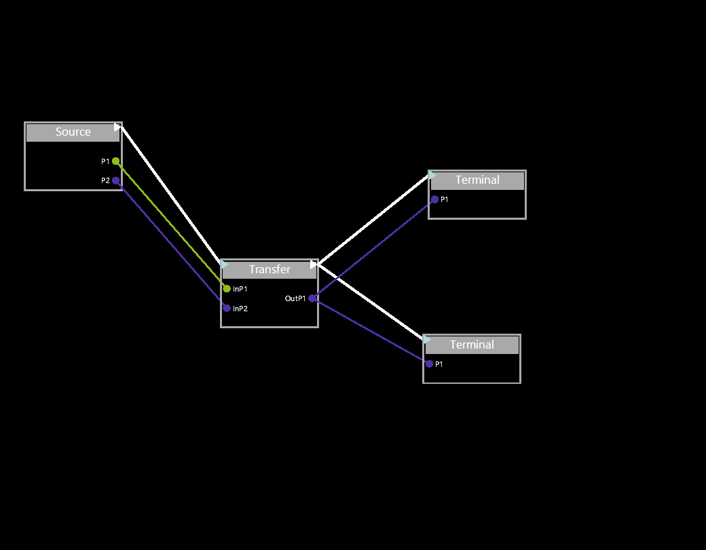

# DataFlow简介 DataFlow Introduce
DataFlow是数据流编程框架的一个轻量实现，没有任何依赖只需要包含头文件即可。数据流编程框架在复杂的数据处理上非常实用，可以方便的进行数据处理逻辑的分离和重组，从而将一个复杂的处理应用解耦。

DataFlow is a lite implement of the dataflow program model, it's a header-only project and easy to use in the data process field. it could split and merge the data process business logically, by this way, it could face a complex data process. 
## DataFlow的抽象概念 DataFlow Abstract Concept
* 节点（Node）
* 触发器（Trigger）
* 信号端（SignalPort）

>节点顾名思义就是组成数据流的单元，多个节点彼此相连即可组成一个数据处理的逻辑链条。
>The node is the basic element of dataflow, many nodes connect to a dataflow graphic for logical business.

>触发器提供控制计算传播的机制，节点的计算是受触发器控制的，触发信号为byte类型，可以提供254种不同的触发值，必要时可以修改类型以支持更多的触发值。计算传播的控制非常重要，它可以减少不必要的计算并支持无关计算的并发执行。
>Triggers provide a mechanism to control the propagation of computations. The computation of nodes is controlled by triggers. The trigger signal is of byte type, and 254 different values can be provided. If necessary, the types can be modified to support more triggers values. Control of computation propagation is important to reduce unnecessary computations and support concurrent execution.

>信号端提供节点和节点间数据的传输通道，输出信号的端口为OutPort，输入信号的端口为InPort，框架通过泛型可以保证信号的关联类型一定是一致的，但是无法保证关联是正确的。
>The signal port provides the data transmission channel between nodes and nodes. The port of the output signal is OutPort, and the port of the input signal is InPort. The framework can ensure that the association type of the signal must be the same through generics, but it cannot guarantee that the association is correct.

## DataFlow使用图形进行表达
很多开源库已经实现了数据流的图形表达，图形表达的优势是直观，但是实际使用时我们大多时候是不会使用UI的。但是UI可以辅助我们进行数据流的搭建工作，例如将UI导出的配置文件生成数据流的框架代码。
Many open-source libraries have implemented the graphical representation of data flow. The advantage of graphical representation is intuitive, but in actual use, we will not use UI most of the time. However, the UI can assist us in the construction of the data flow, such as generating the framework code of the data flow from the configuration file exported by the UI.



## 一个简单的例子 A Simple Example

声明一个源节点（产生源头数据的节点）Declare a source node (node that produces source data)
```cpp
class Source :public INode
{
public:
	OutPort<double> P1;
	OutPort<float> P2;

	Source(): 
		INode("Source", nodeType::nSource),
		P1("P1", "DOUBLE", PortType::POUT),
		P2("P2", "FLOAT", PortType::POUT)
	{

	}

	bool Configuration(string file) override
	{
		return false;
	}

	bool Excute() override
	{
		for (int i = 0; i < 100; i++)
		{
			double d = i;
			float f = i*0.1;
			P1.Submit(&d);
			P2.Submit(&f);
			Tout.TriggerNext();
			ResetTrigger();
		}
		return true;
	};
};
```
数据流在main函数中组装 The data flow is assembled in the main function
```cpp
int main()
{
	TriggerEvent::InfoLevel = Infolevel::none;
	TriggerEvent::OnTrigger = TriggerEvent;

	NodeGraphic ng;

	Source S;
	Transfer Tran;
	Terminal T;
	//add the node to the dataflow graphic
	ng.addNode(S);
	ng.addNode(Tran);
	ng.addNode(T);
	//link the signals of each nodes
	ng.linkSignal(S.P1, Tran.InP1);
	ng.linkSignal(S.P2, Tran.InP2);
	ng.linkSignal(Tran.OutP1, T.InP);
	//define the calculation wave
	ng.connectNode(S, Tran);
	ng.connectNode(Tran, T);

	ng.start();
}
```
当然如果希望数据流在不重新编译代码的情况下重新链接，那么可以借助[chaiscript](https://chaiscript.com/index.html)这种嵌入式脚本来实现
下面这个例子就是将chaiscript作为重组数据流链接的入口，由于仅仅是数据流重组调用了解释性语言，执行并不会受到很大的效率影响。
Of course, if you want the data flow to be relinked without recompiling the code, you can use an embedded script such as [chaiscript](https://chaiscript.com/index.html) to achieve this, The following example uses chai-script as the entry to reorganize the data flow link. Since only the data flow reorganization calls the interpretive language, the execution will not be greatly affected by the efficiency.
```cpp
int main()
{

	chaiscript::ChaiScript chai;

	TriggerEvent::InfoLevel = Infolevel::none;
	TriggerEvent::OnTrigger = TriggerEvent;

	NodeGraphic ng;

	chai.add(chaiscript::user_type<Source>(), "Source");
	chai.add(chaiscript::constructor<Source()>(), "Source");
	chai.add(chaiscript::base_class<INode, Source>());
	chai.add(chaiscript::fun(&Source::P1),"P1");
	chai.add(chaiscript::fun(&Source::P2), "P2");

	chai.add(chaiscript::user_type<Transfer>(), "Transfer");
	chai.add(chaiscript::constructor<Transfer()>(), "Transfer");
	chai.add(chaiscript::base_class<INode, Transfer>());
	chai.add(chaiscript::fun(&Transfer::InP1), "InP1");
	chai.add(chaiscript::fun(&Transfer::InP2), "InP2");
	chai.add(chaiscript::fun(&Transfer::OutP1), "OutP1");

	chai.add(chaiscript::user_type<Terminal>(), "Terminal");
	chai.add(chaiscript::constructor<Terminal()>(), "Terminal");
	chai.add(chaiscript::base_class<INode, Terminal>());
	chai.add(chaiscript::fun(&Terminal::InP), "InP");

	chai.add(chaiscript::var(&ng), "ng");
	chai.add(chaiscript::fun(&NodeGraphic::addNode), "addNode");
	chai.add(chaiscript::fun(&NodeGraphic::linkSignal<float>), "linkSignal");
	chai.add(chaiscript::fun(&NodeGraphic::linkSignal<double>), "linkSignal");
	chai.add(chaiscript::fun(&NodeGraphic::connectNode), "connectNode");

	try {
  //call the chai-script to reorgnaized the dataflow 
		chai.eval(R""(
    var S = Source();
    var Tran = Transfer();
    var T1 = Terminal();
    var T2 = Terminal();

    ng.addNode(S);
    ng.addNode(Tran);
    ng.addNode(T1)  ;
    ng.addNode(T2);
    ng.linkSignal(S.P1, Tran.InP1);
    ng.linkSignal(S.P2, Tran.InP2);
    ng.linkSignal(Tran.OutP1, T1.InP);
    ng.linkSignal(Tran.OutP1, T2.InP);

    ng.connectNode(S, Tran);
    ng.connectNode(Tran, T1);
    ng.connectNode(Tran, T2);
	)"");
	}
	catch (const chaiscript::exception::eval_error& e) {
		std::cout << "Error\n" << e.pretty_print() << '\n';
	}
	ng.start();

}
```
